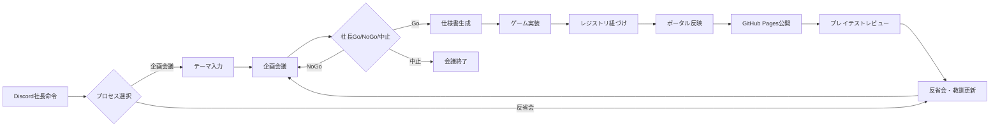

# ゲーム開発プロセス設計書

KOTATSU-SOFT 全体のブラウザゲーム開発プロセスの正本です。セットアップ手順は [README.md](./README.md) を参照してください。

個別ゲームのルール・UI・バランスは本設計書の対象外です。それらは `shared/specs/`・`shared/review/` に置きます。

---

## 1. 目的と適用範囲

### 目的

企画会議から公開・学習までのライフサイクル、命名規約、成果物の置き場、責任分界を定義し、再現可能なゲーム開発プロセスを維持する。

### 適用範囲

| 対象 | 非対象 |
|------|--------|
| Discord 企画会議〜仕様生成 | 個別ゲームのゲームデザイン詳細 |
| ゲーム実装・配置・ポータル反映 | ai-core の内部実装詳細（必要時のみパス参照） |
| GitHub Pages 公開 | インフラ以外のマーケティング運用全般 |
| プレイテスト記録・反省会・教訓更新 | |

---

## 2. システム構成

```
kotatsu-soft/
├── ai-core/           # Discord Bot・会議・仕様生成・反省会・アバター資産
├── game-projects/     # ポータル・社員紹介・各ゲーム（静的 HTML）
├── shared/            # 仕様・会議ログ・レビュー・レジストリ・運用ログ
├── README.md
└── GAME_DEV_PROCESS.md  # 本設計書
```

| コンポーネント | 役割 |
|----------------|------|
| `ai-core/` | Discord Bot。企画会議のオーケストレーション、Go 後の仕様書生成、反省会による教訓更新。アバターは `ai-core/assets/avatars/` |
| `game-projects/` | 公式ポータル（`index.html`）、社員紹介（`staff.html`）、各ゲーム本体。ビルドなしの静的配信 |
| `shared/` | 仕様書・会議ログ・プレイテストレビュー・仕様↔ゲーム紐づけレジストリ・Bot 運用ログ（`logs/`） |
| GitHub Pages | `main` への push で `game-projects` と共有成果物の一部を公開（リポジトリルートの `.github/workflows/game-pages-deploy.yml`） |

Bot 起動・依存関係・環境変数は [README.md](./README.md) の「ai-core セットアップ」を参照。

---

## 3. エンドツーエンド・プロセス



| フェーズ | 概要 | 主な成果物 / 入口 |
|----------|------|-------------------|
| 企画会議 | 社長命令でプロセス選択 → テーマ入力 → 企画検討チャンネルで AI 社員が議論 | `shared/meeting/meeting_{stem}.jsonl` |
| 社長判定 | Go / NoGo / 中止。NoGo は修正方針を入れて再会議（新 `artifact_stem`）。中止は仕様生成・再会議なしで終了 | — |
| 仕様生成 | Go 後に仕様書を自動出力しレジストリへ登録 | `shared/specs/spec_{stem}.md`, `shared/specs/spec_game_links.json` |
| 実装 | 外部エンジン禁止。単一 HTML を原則 | `game-projects/NNN_slug/src/index.html` |
| 紐づけ・ポータル | 仕様とゲームを紐づけ、ポータルにカード追加 | レジストリ、`game-projects/index.html` |
| 公開 | `main` push で Pages 自動デプロイ | 公開 URL |
| プレイテスト | 指摘と修正履歴をレビューに記録 | `shared/review/review_{stem}.md` |
| 反省会 | 成果物から教訓を更新し、次回会議へ反映 | `ai-core/src/agents/*/lessons_learned.yaml` |

NoGo 再会議は毎回新しい `artifact_stem` を発行する。Go した stem だけが仕様・レジストリ・レビュー・反省会の正本になる（§5 / §8）。

---

## 4. 企画会議

### 4.1 登場人物

| 表示名 | role | 主な視点 |
|--------|------|----------|
| すずかちゃん | `pm` | 面白さと実現性の検証、不要要素の削減、最終1案への収束 |
| スゴ杉くん | `dev` | 技術的実現性、難所の見極め、面白さが伝わる実装の落とし所 |
| ヂャイアン | `marketing` | 初見インパクト・拡散のフック、制約を武器にした見せ方 |

設定の詳細は `ai-core/src/agents/*/config.yaml`（社員紹介用の `public_profile` 含む）。共有のスコープ・技術制約は §4.2 のグランドルールが正本。

### 4.2 グランドルール

企画会議で全 AI 社員が共有する制約の正本は次のファイル。

- パス: `shared/meeting/grand_rules.yaml`
- 読込: `ai-core/src/grand_rules_store.py`
- 注入: 各エージェントの system instruction に `【企画会議グランドルール】` として自動挿入する
- 責務分界: スコープ上限・技術スタック・工数の扱いなどの**共有制約**は本 YAML。役割固有の判断軸・口調は各 `config.yaml`

改定手順:

1. `shared/meeting/grand_rules.yaml` を更新する（`updated_at` も更新）
2. 必要なら本設計書の関連節・改定履歴を追記する
3. Bot を再起動して反映する

### 4.3 開始条件

1. Discord の社長命令チャンネル（`PRESIDENT_ORDER_CHANNEL_ID`）に何かメッセージを投稿する
2. Bot が「企画会議 / 反省会」のプロセス選択を返す
3. **企画会議** を選び、Modal にテーマを入力する
4. Bot が企画検討チャンネル（`MEETING_CHANNEL_ID`）で会議を開始する（途中経過・最終提案・Go/NoGo/中止 も同チャンネル）

チャンネル役割:

| チャンネル | 役割 |
|------------|------|
| 社長命令（`PRESIDENT_ORDER_CHANNEL_ID`） | プロセス選択と開始入力（テーマ Modal）。短い誘導のみ |
| 企画検討（`MEETING_CHANNEL_ID`） | 企画会議の途中経過・最終提案・Go/NoGo/中止 |
| 反省会（`POST_MORTEM_CHANNEL_ID`） | 反省会の確認 UI・実行中表示・教訓結果 |

環境変数の置き方は [README.md](./README.md) を参照。

### 4.4 ターン位相

最大おおよそ 10 ターン。ターン番号に応じて位相が切り替わる（実装: `ai-core/src/orchestrator.py` / 表示名: `ai-core/src/phase_labels.py`）。

| ターン | 位相コード | 表示 | ねらい |
|--------|------------|------|--------|
| 1–5 | `DIVERGENCE` | 発散 | 案を広げる |
| 6–7 | `CONFLICT` | 衝突 | トレードオフを突き合わせる |
| 8–10 | `FINAL` | 収束 | 1案に絞り、社長提出へ |

PM が `FINISH_FOR_PRESIDENT` を選ぶと社長判定へ進む。早期終了のガードやターン上限時の強制提出はオーケストレータが制御する。監査ログは `shared/logs/meeting_turn_audit.jsonl` に追記される。

### 4.5 成果物

会議ログは `artifact_stem` 付きで保存される。

- パス: `shared/meeting/meeting_{artifact_stem}.jsonl`
- 命名ロジック: `ai-core/src/artifact_naming.py`

公開時は Pages 成果物に同梱され、`shared/meeting.html` から閲覧できる。

### 4.6 運用ログ（Pages 非公開）

Bot が書き込む運用ログ。GitHub Pages には同梱しない。

| ファイル | 用途 |
|----------|------|
| `shared/logs/proposal_views.json` | 永続 Discord View（社長判定ボタン等）の復元用 |
| `shared/logs/meeting_turn_audit.jsonl` | 位相ガード・ターン監査の追記ログ |

---

## 5. 社長判定（Go / NoGo / 中止）

会議終了後、社長（人間）が企画検討チャンネル上で判定する。

| 判定 | 結果 |
|------|------|
| **Go** | 採用プランの仕様書を自動生成し、`spec_game_links.json` に記録を追加する。このときの `artifact_stem` が仕様・レビュー・反省会の正本になる |
| **NoGo** | 修正方針モーダルに入力 → 方針を最優先として再会議。再会議のたびに `build_artifact_stem(theme)` で **新しい `artifact_stem`** を発行する（実装: `ai-core/src/main.py` の会議開始）。旧会議 jsonl は仕様未生成のまま残りうる |
| **中止** | 仕様書生成・再会議なし。この企画会議を終了する |

Go 直後のメッセージ例（運用上の目印）: 仕様書の自動出力・保存完了通知、および採番された `game_id` / 予定パス。

---

## 6. 仕様生成

### 6.1 出力

- ファイル: `shared/specs/spec_{artifact_stem}.md`
- レジストリ: `shared/specs/spec_game_links.json`（Go 判定後に自動登録）

仕様書はエンジニア向けの実装指示（ファイル構成、UI、コンポーネント、処理フロー）を含む。個別タイトル・ルールの正本は各 `spec_*.md` であり、本設計書には書かない。

### 6.2 レジストリの役割

`spec_game_links.json` は仕様・会議ログ・ゲーム本体を `artifact_stem` / `game_id` で結ぶ。

社長 **Go** で仕様書を生成すると、`ai-core` が **`game_id` と予定ディレクトリ番号（`NNN`）を自動採番**し、`linked_games` に仮登録する（ディレクトリ stub は作らない）。実装時はこの予約値を転記する。

ポータル（`game-projects/index.html`）はレジストリを読み、`data-game-id` ごとに最新の仕様書・会議ログリンクを表示する。

紐づけの手動更新（例外時の再リンク）は [README.md](./README.md) の「仕様書とゲームの紐づけ管理」を参照。

---

## 7. 実装規約

### 7.1 技術方針

- 外部ゲームエンジン（Phaser / Three.js 等）は使わない
- HTML5 Canvas + 素の JavaScript + Web Audio API
- 原則として **単一の `index.html`**（CSS / JS はインライン）
- ビルドツールやパッケージマネージャによるゲームビルドは行わない
- スコープ・技術スタックの上限は `shared/meeting/grand_rules.yaml` に従う

### 7.2 ディレクトリ配置

```
game-projects/
├── index.html                 # ポータル
├── staff.html                 # 社員紹介（プロセス閲覧 UI。ゲーム実装規約の対象外）
├── .nojekyll
├── assets/                    # サムネ・favicon・ブランド画像
├── common/
│   ├── stats.js               # ポータル／ゲーム共用の計測クライアント
│   └── storage.js             # ログイン不要のローカルセーブヘルパー
└── {NNN}_{slug}/
    └── src/
        └── index.html         # ゲーム本体
```

ディレクトリ例: `001_matatabi_chaos` / `002_heavy_love_snake`（個別ルールは各 `shared/specs/spec_*.md` が正本）。

### 7.3 統計連携

ポータル・ゲームとも `common/stats.js`（`window.KotatsuStats`）を使う。Workers URL はモジュール内で一本化する。

| API | 用途 |
|-----|------|
| `KotatsuStats.sendPlayCount(gameId)` | ゲームプレイ増分 |
| `KotatsuStats.sendPortalPv()` | ポータル PV 増分（内部キー `pv`） |
| `KotatsuStats.fetchStats()` | 集計取得 |
| `KotatsuStats.formatCount` / `normalizeCount` | 表示用 |

ゲームから `../../common/stats.js` を読み込み、プレイ開始時などに次を呼ぶ。

```javascript
KotatsuStats.sendPlayCount("your_game_id");
```

引数の `game_id` は仕様作成時に採番されたスラッグ、ディレクトリ名のスラッグ、ポータルの `data-game-id` / `data-stat-id` と **すべて一致**させる。短名別名は禁止。予約キー `pv` はポータル PV 専用でゲーム ID に使わない。

品質ゲート（§9.3）は `sendPlayCount("game_id")` の **文字列リテラル** を要求する。変数や式経由の呼び出しは掲載連携チェックで不合格になる。

### 7.4 ローカルセーブ（ログイン不要）

ハイスコアなど端末内だけで保持するデータは `common/storage.js`（`window.KotatsuStorage`）を使う。認証・サーバー同期は行わない。

| API | 用途 |
|-----|------|
| `KotatsuStorage.get(gameId, key)` | JSON を読み取る（欠落・失敗時は `null`） |
| `KotatsuStorage.set(gameId, key, value)` | JSON で保存（成功 `true` / 失敗 `false`） |
| `KotatsuStorage.remove(gameId, key)` | 1 キー削除 |
| `KotatsuStorage.clear(gameId)` | 当該 `gameId` のキーをすべて削除 |
| `KotatsuStorage.buildKey(gameId, key)` | 内部キー `kotatsu:{gameId}:{key}` |

ゲームから `../../common/storage.js` を読み込み、例:

```javascript
const best = KotatsuStorage.get("your_game_id", "highScore") || 0;
KotatsuStorage.set("your_game_id", "highScore", best);
```

`gameId` は統計連携と同じスラッグと一致させる。private モードや容量超過でも例外を外へ出さない（呼び出し側は戻り値で判定する）。

---

## 8. 命名・配置規約

| 項目 | 規約 | 例 |
|------|------|-----|
| ゲームディレクトリ | `{3桁連番}_{snake_case_slug}` | `001_matatabi_chaos`, `002_heavy_love_snake` |
| エントリ | `.../src/index.html` | `game-projects/001_matatabi_chaos/src/index.html` |
| `game_id` | スラッグ部分（英小文字 snake_case） | `matatabi_chaos`, `heavy_love_snake` |
| 採番タイミング | 社長 Go → 仕様書作成時に自動 | `ai-core/src/game_id_allocator.py` |
| `artifact_stem` | `{テーマスラッグ}_{YYYYMMDD_HHMMSS}` | `テトリスと猫を掛け合わせたゲームを作って_20260725_124622` |
| 仕様 | `shared/specs/spec_{stem}.md` | |
| 会議ログ | `shared/meeting/meeting_{stem}.jsonl` | |
| レビュー | `shared/review/review_{stem}.md` | |
| ポータル属性 | `data-game-id` / `data-stat-id` = `{game_id}` | 両者は同一必須（`data-stat-id` は省略可） |
| サムネ | `game-projects/assets/{NNN}_{slug}.png` | |
| 統計予約キー | `pv`（ポータル PV） | ゲーム ID に使わない |

`game_id` の採番:

1. 仕様書に LLM が `- game_id: english_snake_case` を出力（検証・衝突時は `_2` 等）
2. `NNN` は `game-projects/` ディレクトリとレジストリ `game_path` の最大番号 + 1
3. 抽出失敗時は `game_{NNN}`（例: `game_002`）
4. 一度採番したら変更しない

`artifact_stem` の生成・パス解決は `ai-core/src/artifact_naming.py` が正。

- 会議開始（初回・NoGo 再会議とも）のたびに新しい `artifact_stem` が発行される
- **Go 以降**の仕様・会議ログ・レビューは **同じ `artifact_stem`** で揃える。反省会・レジストリ解決の前提になる
- NoGo で打ち切られた旧会議 jsonl はレジストリ未登録のまま残りうる（正本ではない）

---

## 9. 紐づけとポータル反映

### 9.1 仕様↔ゲーム紐づけ

Go 時点で `linked_games` に `game_id` / 予定 `game_path` が仮登録される。実装ではその値でディレクトリを作成する。

タイトル更新やパス修正が必要なときだけ、手動スクリプトで再リンクする。

```bash
cd kotatsu-soft/ai-core
python scripts/link_spec_to_game.py \
  --spec spec_xxx.md \
  --game-id your_slug \
  --game-path game-projects/00N_your_slug/src/index.html \
  --game-title "タイトル"
```

### 9.2 ポータル更新チェックリスト

1. レジストリの予約 `game_id` / `game_path` を確認する
2. `game-projects/{NNN}_{slug}/src/index.html` を実装する（予約どおりのディレクトリ名）
3. `game-projects/index.html` にカードを追加し、`data-game-id` / `data-stat-id` / `sendPlayCount("game_id")`（文字列リテラル）を同一 `game_id` にする
4. `game-projects/assets/{NNN}_{slug}.png` にサムネを置く
5. 仕様・会議リンクがポータルから辿れることを確認する
6. 品質ゲート（§9.3）をローカルまたは CI で通す

### 9.3 品質管理（構文検知・ポータル掲載連携）

完成ゲーム公開前の自動品質ゲート。実装は `ai-core` 側。

| チェック | 内容 | 入口 |
|----------|------|------|
| HTML/JS 構文 | `game-projects/*/src/index.html`・ポータル・`common/*.js` の DOCTYPE / `<script>`・`<style>` 対応・インライン／外部 JS 構文（Node `node --check`） | `ai-core/src/game_syntax_check.py` |
| ポータル自動掲載連携 | レジストリで紐づき実ファイルがあるゲームが、ポータルカード・プレイリンク・`data-game-id` / `data-stat-id`・`sendPlayCount("game_id")`（文字列リテラル）と一致していること | `ai-core/src/portal_listing_check.py` |

CLI 入口: `ai-core/scripts/check_game_quality.py`

```bash
cd kotatsu-soft/ai-core
python scripts/check_game_quality.py
# または
pytest -q tests/test_game_syntax_check.py tests/test_portal_listing_integration.py
```

- CI: リポジトリルートの `.github/workflows/game-quality.yml`
- Pages デプロイ前ゲート: `.github/workflows/game-pages-deploy.yml` の `quality` ジョブ

仮登録のみ（HTML 未作成）のゲームは掲載連携の対象外。実ファイルが存在する完成ゲームだけを検証する。

### 9.4 社員紹介・アバター（閲覧 UI）

プロセス成果物の公開閲覧面であり、ゲーム実装規約の対象外。

| 項目 | 内容 |
|------|------|
| 社員紹介 | `game-projects/staff.html`。各エージェントの `public_profile` と `lessons_learned.yaml` を GitHub raw から読み表示 |
| アバター | `ai-core/assets/avatars/{pm,dev,marketing,nobuta}.png`。`staff.html` / `shared/meeting.html` が raw.githubusercontent.com 経由で参照 |
| ポータル導線 | `index.html` から `staff.html` へリンク |

---

## 10. 公開（GitHub Pages）

### トリガ

- `main` ブランチへの push（対象パス: `kotatsu-soft/game-projects/**`, `kotatsu-soft/shared/**`, ワークフロー自身）
- Actions からの手動実行（`Deploy game-projects to GitHub Pages`）

### デプロイ内容（同梱）

ワークフローは次を Pages ルートに載せる。

- `game-projects/` 全体（ポータル・`staff.html`・各ゲーム・`assets/`・`common/`）
- `shared/spec.html`・`shared/meeting.html`
- `shared/specs/*`（仕様 Markdown・レジストリ）
- `shared/meeting/*.jsonl`（会議ログ）

### デプロイ対象外（非同梱）

- `shared/review/`（プレイテストレビュー）
- `shared/logs/`（Bot 運用ログ）
- `ai-core/` 本体（アバターは raw.githubusercontent.com 経由で参照）

初回の Pages ソース設定（GitHub Actions）は [README.md](./README.md) の「GitHub Pages 公開」を参照。

公開 URL のトップは `game-projects/index.html` 相当。

---

## 11. プレイテストレビュー

### 目的

実装後の指摘と修正履歴を、**Go した**仕様・会議と同じ `artifact_stem` で残し、反省会の入力にする。

### 置き場

`shared/review/review_{artifact_stem}.md`

Pages には同梱されない（リポジトリ内の運用成果物）。

### 推奨構成

既存レビュー（`shared/review/`）に倣い、少なくとも次を含める。

- メタ情報（タイトル、`game_id`、ゲームパス、対応仕様・議事録、`artifact_stem`）
- 最終仕様スナップショット（プレイテスト反映後のルール要約）
- レビュー履歴（Round ごとの指摘と対応）

個別の指摘内容は本設計書には書かない。

---

## 12. 反省会（教訓更新）

### 目的

仕様・会議ログ・レビュー・完成コードを読み、各 AI 社員の教訓（1〜2文×3個程度）を進化させる。レビュー指摘を最優先し、具体→抽象化した再発防止則へ更新する（言い換えのみは禁止）。

更新された教訓は次回企画会議の system instruction に自動で入り、テーマ非依存の原則として発言に反映される。社員紹介ページ（`staff.html`）からも公開表示される。

### 出力先

- `ai-core/src/agents/pm/lessons_learned.yaml`
- `ai-core/src/agents/dev/lessons_learned.yaml`
- `ai-core/src/agents/marketing/lessons_learned.yaml`

### 前提

1. 仕様・会議ログ・レビューが **Go した同じ `artifact_stem`** で揃っている
2. できれば `spec_game_links.json` でゲーム本体へ紐づいている（未紐づけなら `--game-path` を指定）
3. `ai-core/.env` に `GEMINI_API_KEY` がある

### 実行

CLI・Discord からの起動手順は [README.md](./README.md) の「開発完了後の自動反省会（教訓更新）」を参照。

- CLI: `ai-core/scripts/post_mortem.py`
- Discord: 社長命令チャンネルから「反省会」を選択。確認 UI・進捗・結果は反省会チャンネル（`POST_MORTEM_CHANNEL_ID`）へ投稿

---

## 13. 新規ゲーム通しチェックリスト

運用時は本節だけ追ってもよい。

- [ ] Discord の社長命令チャンネルから企画会議を開始し、完走する
- [ ] 社長が **Go** する（NoGo なら修正方針を入れて再会議。再会議は新 `artifact_stem`）
- [ ] 仕様書・レジストリ・Discord 通知の **自動採番 `game_id` / 予定パス** を確認する（Go した stem が正本）
- [ ] 予約どおりの `game-projects/{NNN}_{slug}/src/index.html` を実装する（単一 HTML・外部エンジンなし）
- [ ] `KotatsuStats.sendPlayCount("{game_id}")` を **文字列リテラル** で入れる（予約 ID と一致。変数経由は不可）
- [ ] 永続化が必要なら `KotatsuStorage`（`common/storage.js`）を使い、`game_id` でキーを名前空間化する
- [ ] ポータルにカード・サムネ・`data-game-id` / `data-stat-id` を追加する（同一 ID）
- [ ] （必要なときだけ）`link_spec_to_game.py` でタイトルやパスを更新する
- [ ] `python scripts/check_game_quality.py` で構文・ポータル掲載連携を通す
- [ ] `main` に push し、Pages 反映を確認する
- [ ] `shared/review/review_{stem}.md` にプレイテスト結果を残す（Go した stem）
- [ ] 反省会（CLI または Discord）で教訓を更新する

---

## 14. 本設計書のメンテナンス方針

1. **プロセス変更時は本ファイルを先に更新する。** README はセットアップ・短い手順・本設計書へのリンクに留める。
2. **個別仕様・レビューは `shared/` に置く。** 本ファイルへは一般化した規約・フェーズだけ反映する。
3. **企画会議の共有制約は `shared/meeting/grand_rules.yaml` を正本とする。** 役割固有の評価軸は `ai-core/src/agents/*/config.yaml`。
4. **用語はコードと揃える。** `artifact_stem` / `game_id` / `DIVERGENCE`・`CONFLICT`・`FINAL` / Go・NoGo・中止 / `FINISH_FOR_PRESIDENT` など。
5. **改定したら下表に追記する。**

### 改定履歴

| 日付 | 要約 |
|------|------|
| 2026-07-30 | 実装実態に同期。NoGo 再会議の新 artifact_stem、sendPlayCount 文字列リテラル必須、staff.html / アバター / shared/logs、Pages 同梱・非同梱範囲、グランドルール読込パス、002_heavy_love_snake 命名例を明文化 |
| 2026-07-30 | 社長判定に「中止」を追加。Go/NoGo/中止の3択とし、中止は仕様生成・再会議なしで終了 |
| 2026-07-30 | ログイン不要のローカルセーブ共通ヘルパー（`KotatsuStorage` / `storage.js`）を追加。matatabi_chaos にハイスコア配線 |
| 2026-07-30 | 品質管理を追加。完成ゲーム HTML/JS 構文検知とポータル自動掲載連携テスト（CI・Pages デプロイ前ゲート） |
| 2026-07-30 | 企画会議グランドルールを `shared/meeting/grand_rules.yaml` に正本化。PM/Dev/Marketing config から共有制約を分離 |
| 2026-07-30 | 仕様作成時の game_id 自動採番。stats.js 一本化。ID 一致規約を明文化 |
| 2026-07-30 | チャンネル役割分離。社長命令は選択のみ、経過・結果は企画検討／反省会チャンネルへ |
| 2026-07-30 | 社長命令チャンネルへ入口を統一。プロセス選択（企画会議／反省会）とテーマ Modal を追加。旧称「無茶ぶり」を廃止 |
| 2026-07-30 | 初版。企画会議〜反省会までの全体プロセスを文書化 |
