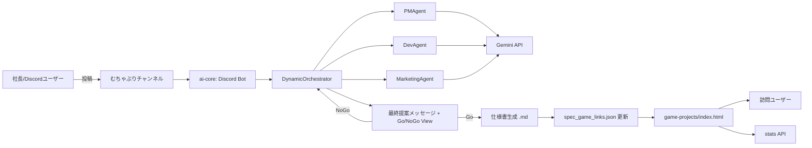
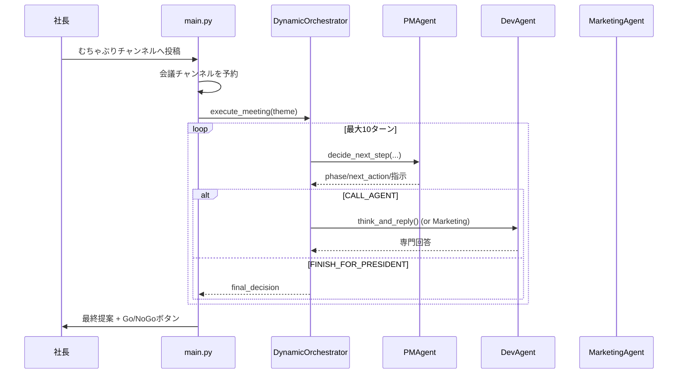

# kotatsu-soft 全体設計書

作成日: 2026-07-22  
対象リポジトリ: kotatsu-soft

## 1. 目的

本書は、`kotatsu-soft` のシステム全体像、コンポーネント責務、主要なデータフロー、運用手順を整理し、次の目的を満たす。

- 新規参加メンバーの立ち上がりを早める
- 機能追加時の影響範囲を判断しやすくする
- 障害時の切り分けポイントを明確化する

## 2. システム概要

`kotatsu-soft` は、以下 3 つの領域で構成される。

- AI 会議/仕様化基盤 (`ai-core`)
- ブラウザゲーム公開基盤 (`game-projects`)
- 共通成果物/ログ領域 (`shared`)

Discord 上で社長のむちゃぶりを受けると、PM/Dev/Marketing の AI エージェントが会議を行い、最終提案を `Go / NoGo` 判定にかける。`Go` の場合は仕様書 Markdown を生成し、仕様書とゲームの紐づけ情報をレジストリへ登録する。ポータルページはこのレジストリを参照し、各ゲームへの「仕様書を見る」導線を最新化する。

## 3. 論理アーキテクチャ

## 4. ディレクトリ設計

### 4.1 `ai-core`

- `src/main.py`
  - Discord Bot の起動
  - メッセージ受信 (`on_message`)
  - 会議実行トリガー (`run_meeting_round`)
  - 永続 View 復元 (`_restore_persistent_views`)
  - 会議監査ログ出力 (`meeting_turn_audit.jsonl`)
- `src/orchestrator.py`
  - 会議進行制御 (`DynamicOrchestrator`)
  - フェーズガードレール (DIVERGENCE/CONFLICT/FINAL)
  - 投稿経路 (Webhook 優先 + fallback)
  - 社長向け最終文面生成
  - `Go/NoGo` ボタン UI (`ProposalSelectView`)
- `src/agents/*`
  - `pm/agent.py`: ターン制御判断、最終提案、仕様書生成
  - `dev/agent.py`: 実装観点回答
  - `marketing/agent.py`: 訴求/拡散観点回答
  - `base_agent.py`: 共通 LLM 呼び出しリトライ、YAML 設定ロード
- `src/config.py`
  - `.env` 読み込み
  - 必須環境変数バリデーション
- `src/spec_link_registry.py`
  - 仕様書レジストリ (`shared/specs/spec_game_links.json`) 読み書き
  - 仕様書とゲームの紐づけ更新
- `tests/`
  - Orchestrator、Config、Registry、Main の単体/非同期テスト

### 4.2 `game-projects`

- `index.html`
  - ポータル UI
  - 各ゲームへの導線
  - 統計表示 (総PV、総プレイ数、ゲーム別プレイ数)
  - `spec_game_links.json` から仕様書リンクを解決
- `001_mikan_buster/src/index.html`
  - 10 秒シューティング (Canvas)
  - 開始時にプレイ計測送信
- `002_nyanko_dive/src/index.html`
  - ネコ積みバランスゲーム (Canvas)
  - 開始時にプレイ計測送信
- `common/stats.js`
  - 既存互換の軽量計測 (`sendPlayCount`)
- `common/stats-client.js`
  - 統計 API クライアント (GET/POST + Beacon fallback)

### 4.3 `shared`

- `shared/specs/*.md`
  - 会議の最終提案から生成される仕様書
- `shared/specs/spec_game_links.json`
  - 仕様書メタデータとゲーム紐づけレジストリ
- `shared/logs/meeting_turn_audit.jsonl`
  - 会議ターン監査ログ
- `shared/logs/proposal_views.json`
  - 永続化された Go/NoGo View 復元情報

## 5. 実行アーキテクチャ

### 5.1 ローカル実行

- Python 3.11 系で `ai-core/src/main.py` を直接起動
- `.env` から設定を読み込み Discord Bot として接続

### 5.2 Docker 実行

`docker-compose.yml` により主に次を起動する。

- `ai-core`
  - Python 実行コンテナ
  - `./ai-core`, `./shared`, `./game-projects` をマウント
- `webtop`
  - ブラウザ操作や撮影向けの GUI コンテナ
  - ワークスペースを `webtop-config/workspace` 配下にマウント

## 6. 主要シーケンス

### 6.1 アイデア投稿から最終提案まで

### 6.2 Go 判定時

1. `ProposalSelectView` の Go callback が発火  
2. `PMAgent.generate_spec_for_plan()` で仕様書 Markdown を生成  
3. `shared/specs/spec_*.md` を保存  
4. `register_generated_spec()` で `spec_game_links.json` を更新  
5. ポータルで最新仕様書リンクとして参照可能になる

### 6.3 NoGo 判定時

1. モーダルに修正方針を入力  
2. `run_meeting_round(theme, meeting_channel, revision_guidance)` を再実行  
3. 修正方針を制約として再会議を実施

## 7. ガードレール設計 (会議品質制御)

`DynamicOrchestrator` と `PMAgent` の二層で制御する。

- フェーズ固定
  - Turn 1-5: DIVERGENCE (発散)
  - Turn 6-7: CONFLICT (比較/衝突)
  - Turn 8-10: FINAL (収束)
- 早期提出抑止
  - Turn 1-5 の `FINISH_FOR_PRESIDENT` を強制ブロック
- 早期終了条件
  - Dev/Marketing の両視点収集済み
  - トレードオフ比較済み
- 膠着検知
  - 発言の繰り返しや ping-pong を検出し収束モードへ
- 監査ログ
  - 各ターンの判定・補正履歴を `meeting_turn_audit.jsonl` に記録

## 8. データ設計

### 8.1 `spec_game_links.json` 概要

- `schema_version`: レジストリスキーマ版
- `updated_at`: 最終更新時刻
- `records[]`
  - `spec_file`, `spec_path`
  - `selected_plan`, `proposal_summary`, `theme`
  - `created_at`
  - `linked_games[]`
    - `game_id`, `game_path`, `game_title`, `linked_at`

### 8.2 永続 View データ

`shared/logs/proposal_views.json` に以下を保持し、Bot再起動時に View を復元する。

- `message_id`
- `channel_id`
- `theme`
- `final_recommendation`
- `final_category`
- `revision_guidance`

## 9. 外部依存

### 9.1 Python パッケージ

- `discord.py`
- `google-genai`
- `pydantic`
- `pyyaml`
- `aiohttp`
- `python-dotenv`

### 9.2 外部サービス

- Discord API
- Gemini API
- プレイ統計 API (Cloudflare Workers 想定の HTTP API)

## 10. 設定値

`Config.load()` で以下を必須ロードする。

- `DISCORD_TOKEN`
- `MUCHABURI_CHANNEL_ID`
- `GEMINI_API_KEY`
- `MEETING_CHANNEL_ID`
- `PRESIDENT_MENTION`

不足時は起動時に `ConfigError` で停止する。

## 11. テスト設計

`ai-core/tests` では以下を検証している。

- 会議進行の正常系/異常系
- 早期終了やエラー通知の挙動
- チャンネル取得 fallback (`get_channel` -> `fetch_channel`)
- 仕様書レジストリ登録/紐づけ
- 環境変数ロード

`pytest.ini` は `pythonpath = src`, `asyncio_mode = auto` を使用。

## 12. 非機能設計

- 可用性
  - `ai-core` コンテナは `restart: unless-stopped`
- 耐障害
  - LLM 呼び出しはタイムアウト + リトライ
  - Webhook 失敗時は通常メッセージ送信に fallback
- 運用性
  - 監査ログと View 永続化で再現性を確保
- 拡張性
  - エージェント追加は `agents/` と `other_agents` 拡張で対応可能

## 13. 既知の運用上の注意

- `game-projects/common/stats.js` と `game-projects/common/stats-client.js` で API ベース URL が異なるため、運用環境で統一方針を決めること。
- `stats.js` のゲーム ID は `mikan` / `nyanko`、仕様書連携側は `mikan_buster` / `nyanko_dive` を使用しているため、分析・可視化用途では ID 対応表を明示すること。

## 14. 今後の改善候補

- ポータル/ゲームの計測実装を `stats-client.js` に一本化
- ゲーム ID の命名規約統一
- 仕様書テンプレートのバージョニング
- 監査ログから品質メトリクスを自動集計するバッチ追加
